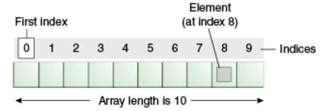
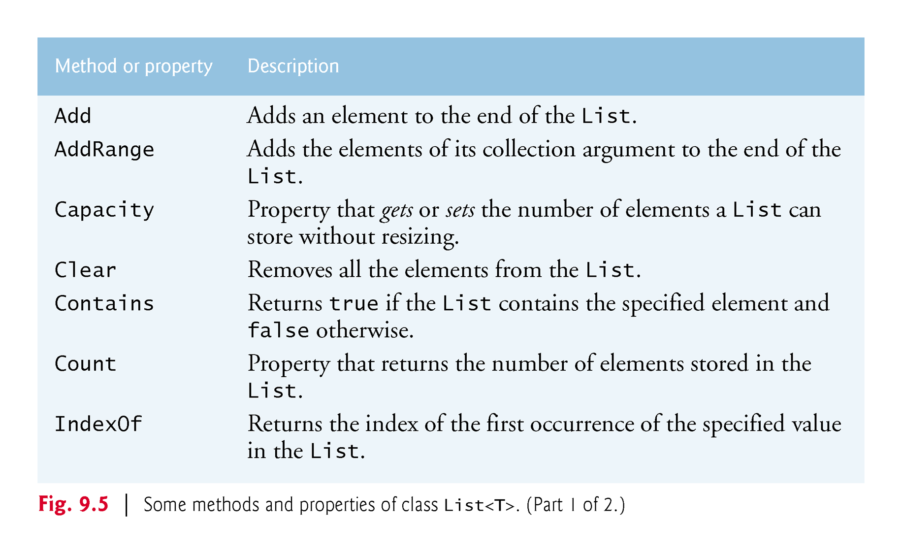
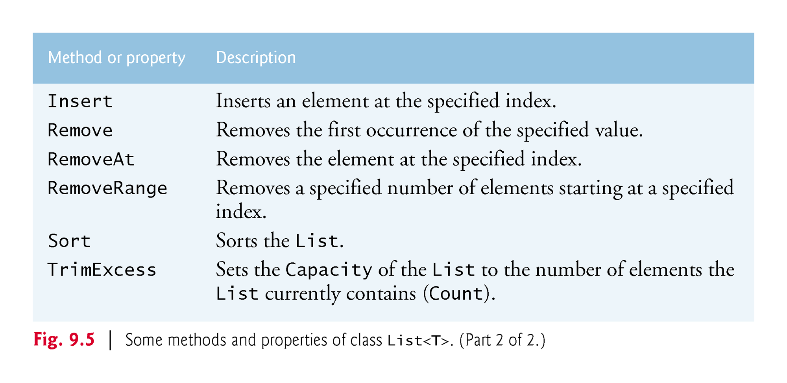

# Week 3 - LINQ and List Collection

# RECAP - Week 3 Part 1 - Introduction to LINQ

- LINQ is an integrated query language that can be used various data sources (objects, sql or xml)
- Has two ways of constructing queries:

    | Query Syntax  | Method Syntax |
    | ------------- | ------------- |
    |<pre>static void Main()<br>{<br>int[] numbers = newint[7]{0,1,2,3,4,5,6};<br><br>**var numQuery=<br>from num in numbers<br>where num % 2<br>select num;**<br><br>foreach(int num in numQuery)<br>{<br>  Console.Write(num);<br>}<br>}<br></pre>|<pre>static void Main()<br>{<br>int[] numbers=newint[7]{0,1,2,3,4,5,6};<br><br>**var numQuery = numbers.Where(num => num % 2);**<br><br>foreach(int num in numQuery)<br>{<br>  Console.Write(num);<br>}<br>}<br></pre>
- All queries, by default, has Deferred Execution (will query data at time of evaluation)
- Lambdas, aka anonymous functions, are used with Method Syntax
- Query syntax is preferred, used Method syntax only when needed

# Week 3 Part 2 - Introduction To Collections

# Arrays
- Arrays are a data structure where a set of elements of the same data type can be stored.
- Arrays have a fixed size, and at runtime the framework allocates a fixed space in memory for elements
    ```csharp 
    int[] a;
    a = new int[10];
    a[0] = 20;
    a[1] = 21;
   ```
    

## Advantages of Arrays
- **Predictable memory allocation**: Fixed arrays allocate a known amount of memory, making memory management predictable.
- **Efficiency for a known number of elements**: When the number of elements is known in advance and won't change, fixed arrays can be efficient.
## Disadvantages of Arrays
- **Inflexibility**: Fixed arrays cannot change in size once they are created, which can be problematic when the number of elements varies.
- **Wasted memory**: Fixed arrays reserve memory for their maximum size, even if not all elements are used, resulting in potential memory wastage
- **Adds Complexity**: Requires null error handling, if not all elements are use

# `List<T>` Collection
- .NET Framework provides several classes, called Collections, used to store groups of related objects
- Provides efficient methods that organize, store and retrieve your data without requiring the implementation details
-  The generic collection class `List<T>` (from namespace `System.Collections.Generic`) does not need to be reallocated to change its size.
- `List<T>` is called a generic class because it can be used with any type of object.
- `T` is a placeholder for the type of he objects stored in the list
## Advantages of a `List<T>`
- **Dynamic resizing**: Lists can automatically adjust their size.
- **Built-in methods**: Lists provide built-in methods for common operations.

## Using `List<T>`

- Declaring a `List<T>`
    ```csharp
    List<int> a = new List<int>();
    List<string> b = new List<string>();
    ```
- Adding to a `List<T>` use `.Add()`
    ```csharp
    List<int> a = new List<int>();
    List<string> b = new List<string>();
    a.Add(1);
    a.Add(2);
    b.Add("acme");
    ```
- Removing from a `List<T>` use `.Remove()`
    ```csharp
    List<string> b = new List<string>();
    b.Add("acme");
    a.Remove("acme"); 
    ```
- Get number of elements in `List<T>` use `.Count`
    ```csharp
    List<int> a = new List<int>();
    a.Add(1);
    a.Add(2);
    int numberOfElements = a.Count;
    ```
- Check if `List<T>` contains an element value use `.Contains()`
    ```csharp
    List<string> a = new List<string>();
    a.Add("acme");
    bool hasValue = a.Contains("acme");
    ```

## Common Methods of List<<T>>




# Exercise
[`List` Exercise](https://github.com/tgunness/ProgrammingInDotnet/blob/main/Exercises/Week%203/LISTWeeklyExercise.md)


# Lab 1 - Working Session and Code Review

The remainder of class will be used for working on Lab 1.

I can review the code you have thus far and provide feedback that may help you improve the grade on the assignment.