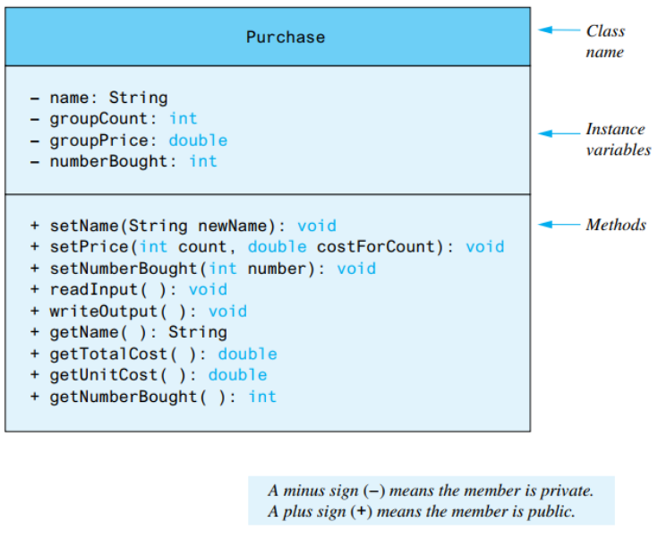
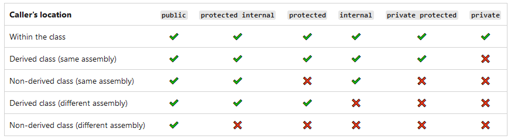

# [Programming in .NET](https://tgunness.github.io/ProgrammingInDotnet/Week4Part1.html) 
#### by Prof. Trishan Gunness 
---
# Schedule:
- Week 1 - Introduced .NET & Visual Studio
- Week 2 - Introduced C# Language
- Week 3 - Introduced Lists and LINQ
- ***Week 4 & 5 - Fundamentals of OOP***
---
# Last Class - Objects & Classes

- **OOP** is based on objects
- An **Object** are metaphors for real-world objects or entities (ie. Pen, Apple)
- A **Class** is simply a blueprint of objects. They contain
  - State (variables)
  - Behavior (methods) 
  - Constructor(s)
---
# Last Class - How to diagram Classes



---
# Last Class - How to code Classes (C#)
```csharp 
public class Apple //<--Class Name
{
  public Apple() //<--Constructor
  {
    Color = "Red";  
  }

  public string Color { get; set; } //<--Instance Property
  public int Radius { get; set; } //<--Instance Property
  
  private int volume; //<--Instance Variable

  public int CalculateVolume() //<--Instance Method
  {
    volume =  4/3 * Math.PI * Radius * Radius * Radius;
  }
}
```
---
# Last Class - Access Modifiers (C#)


`public` and `private` are the most commonly used 

   ```csharp 
  public string a { get; set; }
  private string b;
  ```
---

# Today

### Deeper Look at Objects & Classes
- Destruction of Classes (Finalizer and Dispose)
- Object initializers
- Object browser
- Overloaded Constructors
- Overloaded Methods
- `readonly` Instance Variables
- Extension Methods

### Relationships between Objects & Classes
- Inheritance

---

# Destruction of Classes (Finalizer and Dispose)

- Finalizers method is called by the Garbage Collector when a class instance is being collected - you can not call your Finalizer in code
- `Dispose()` method is part of `IDisposable` is meant to be called by the code that created your class so that you can clean up and release any resources you have acquired (file, db connections, etc.).
- The standard practice is to implement `Dispose` so that you can use your object in a `using` statement. And in your Finalizer, call `Dispose()`, just in case the calling code forgot to dispose for you.

---
# Finalizer and Dispose Code

```csharp
class Car : IDisposable
{
    //...

    public void Dispose()
    {
      //cleanup statements
    }

    ~Car()  // finalizer
    {
        Dispose();
    }

}
```
---
# Object initializers
Object initializers allow you to create an object and initialize its public properties in the same statement

```csharp
public class Cat
{
    public int Age { get; set; }
    public string Name { get; set; }

    public Cat() { }
}

Cat cat = new Cat { Age = 10, Name = "Fluffy" };
Cat sameCat = new Cat("Fluffy"){ Age = 10 };
```

---
# `readonly` Instance Variables

`readonly` indicates that assignment to the field can only occur as part of the declaration or in a constructor in the same class. A `readonly` field can't be assigned after the constructor exits.

```csharp
public class Age
{
    private readonly int _year;
    private readonly int _month = 12;
    public Age(int year)
    {
        _year = year;
    }
    public void ChangeYear()
    {
        //_year = 1967; // Compile error if uncommented.
    }
}
```


---
# Overloaded Constructors
- If a class has multiple method of the same name but different parameters, this is **Overloading**. 
- You can overload your constructor by changing the parameters of the method.

```csharp
public class Cat
{
    public int Age { get; set; }
    public string Name { get; set; }

    public Cat() { }
    public Cat(int age) 
    { 
      Age = age; 
    }
    public Cat(int age, string name) 
    { 
      Age = age; 
      Name = name;
    }
}
```
---
# Overloaded Methods
- You can overload methods by changing its parameters
```csharp
public class Cat
{
    public int Age { get; set; }
    public string Name { get; set; }

    public string GenerateCatName()
    {
      Name = Guid.NewGuid();
    }
    public string GenerateCatName(string name)
    {
      Name = name + Age.ToString();
    }    
}
```
---
# Extension Methods
- Extension methods enable you to "add" methods to existing types without modifying the original type. This is similar to LINQ (ie. )
- The most common extension methods are the LINQ standard query operators that add query functionality.
```csharp
namespace ExtensionMethods
{
    public static class MyExtensions
    {
        public static int WordCount(this string str)
        {
            return str.Split(new char[] { ' ', '.', '?' },StringSplitOptions.RemoveEmptyEntries).Length;
        }
    }
}
using ExtensionMethods;
string s = "Hello Extension Methods";
int i = s.WordCount();
```
---

# Exercise
```
- Create a Dog Class.
- A dog has a Name and Age as its public attributes (Name should be readonly)
- A dog has isGroomed as a private attribute and
- A dog has a Groom behavior
- Include: 
  - Add two overloaded constructors: 
     - a default constructor (that gives dog a random name and age of 0 and isgood true)
     - a parameterized constructor, that requires Name and Age
  - Make Name readonly
  - Add a finalizer and dispose() which sets Name  to "deceased"
  - Add two overloaded methods for Groom
    - one that takes not params, set isGroomed true and outputs "Groomed"
    - one that take in a integer for hours, set isGroomed true and output "Grooming took {x} hours"
- Create an DogExtensions Class that has the extensions
  - IsGood, which outputs all dogs that have names starting with "L"
  - IsGroomed, which output all dogs that 
- In Program.cs, initialize 10 Dogs using the Object Initializer
```
---

# Conclusion

- Destruction of Classes (Finalizer and Dispose)
- Object initializers
- Object browser
- Overloaded Constructors
- Overloaded Methods
- `readonly` Instance Variables
- Extension Methods

Next Class: Object Relationships
---

---
# More Information
- **Finalizers**: https://learn.microsoft.com/en-us/dotnet/csharp/programming-guide/classes-and-structs/finalizers
- **Extension Methods**: https://learn.microsoft.com/en-us/dotnet/csharp/programming-guide/classes-and-structs/extension-methods
- **`readonly`**: https://learn.microsoft.com/en-us/dotnet/csharp/language-reference/keywords/readonly
- **Constructors**: https://learn.microsoft.com/en-us/dotnet/csharp/programming-guide/classes-and-structs/constructors
- **Inheritance**: https://learn.microsoft.com/en-us/dotnet/csharp/fundamentals/object-oriented/inheritance
- **Object Initializers**:https://learn.microsoft.com/en-us/dotnet/csharp/programming-guide/classes-and-structs/object-and-collection-initializers

