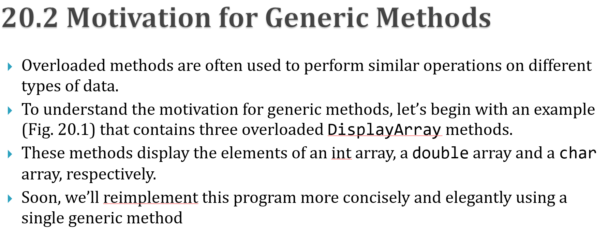
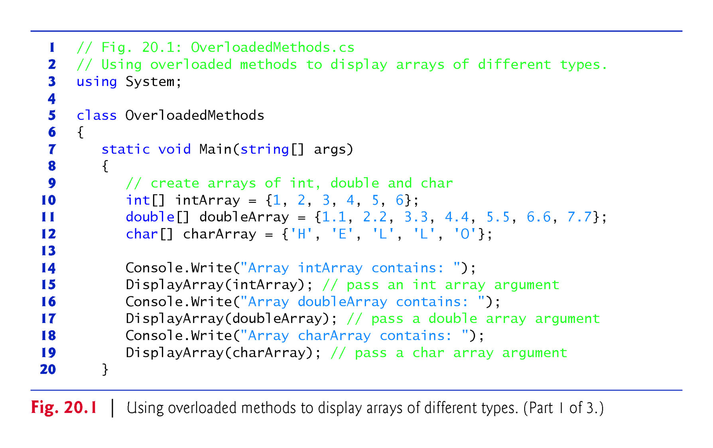
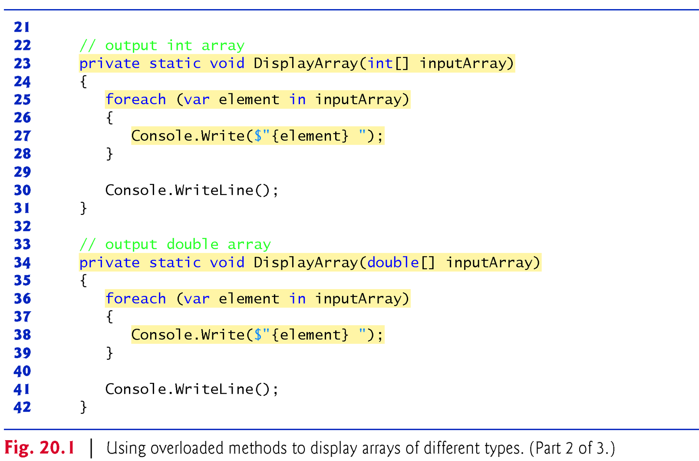
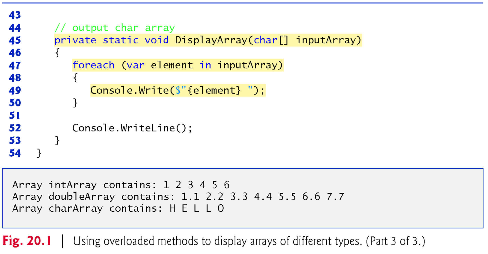
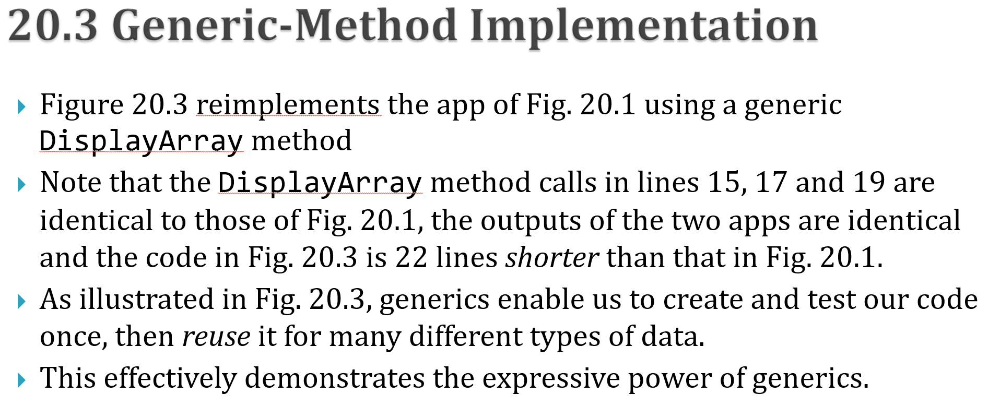
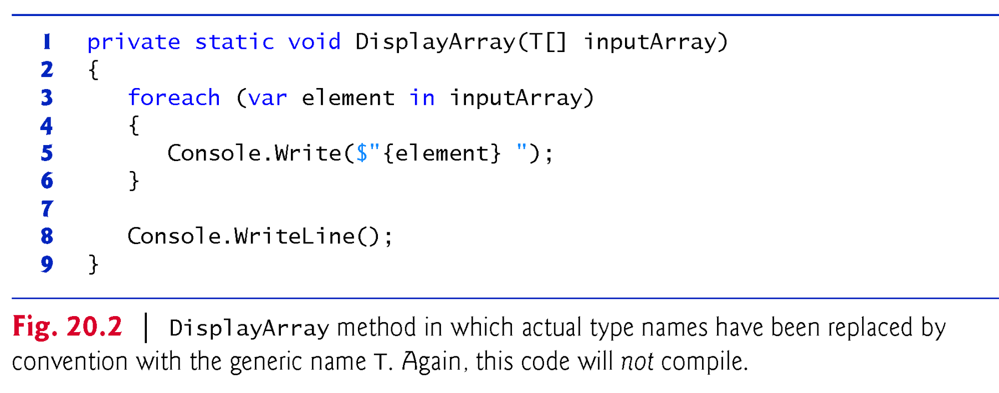
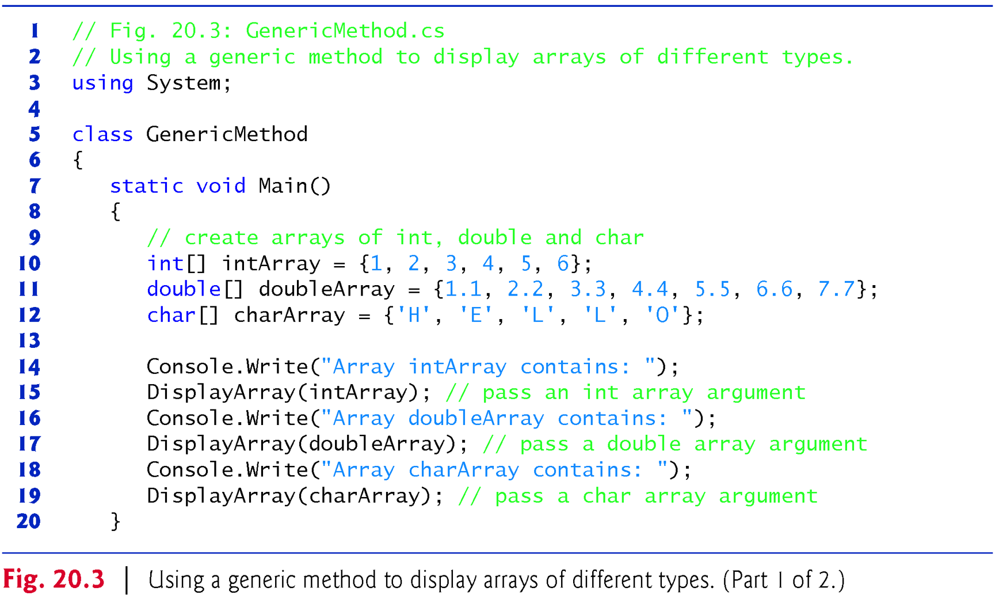
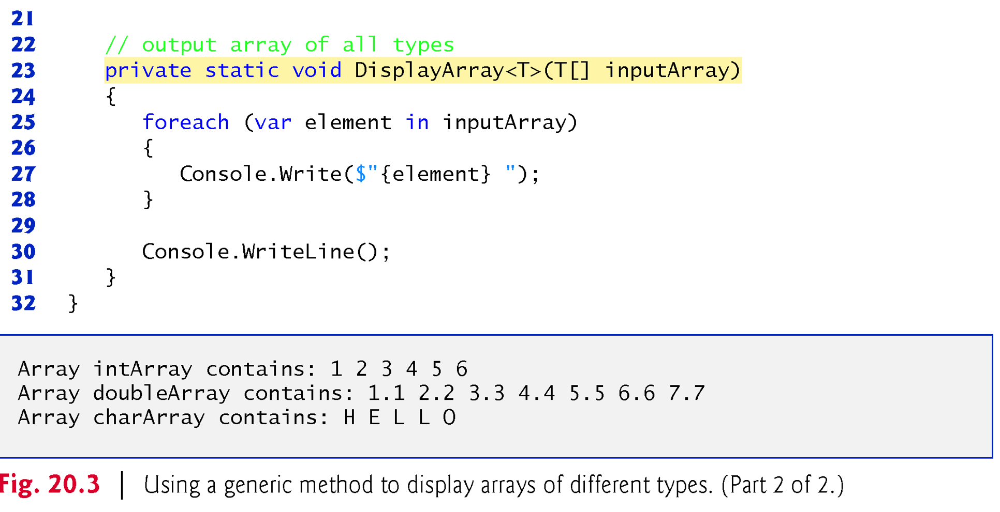
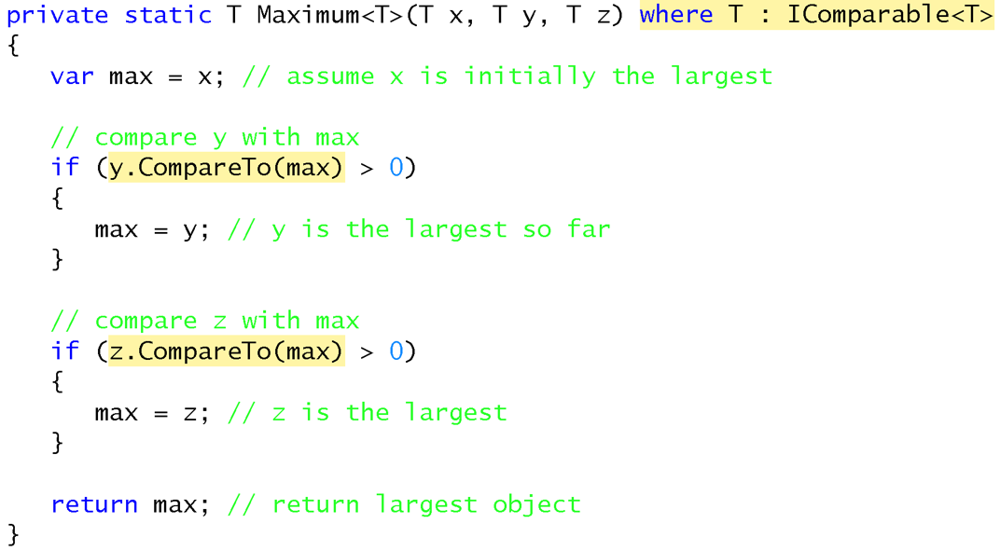

# Programming in .NET
#### by Prof. Trishan Gunness 
---
# Announcements  

- Assignment Lab 3 due <span style="color:red;">**March 24th 2024 11:59pm**</span>
- Assignment Lab 4 due **March 31st 2024 11:59pm**
- Assignment Lab 5 due **April 14th 2024 11:59pm (no late days)**
  - See ["How to upload your game to Canvas"](https://www.youtube.com/watch?v=PNpVoE8w2r8)
---
<style scoped>section { font-size: 25px; }</style>
# Recap:
- Week 1- Introduced .NET & Visual Studio
- Week 2 - Introduced C# Language
- Week 3 - Introduced Lists and LINQ
- Week 4 - OOP Fundamentals - Classes and Objects
- Week 5 - OOP Fundamentals - Relationships
- Week 6 - GUI - Forms and Events
- Week 7 - Midterm
- Week 8 Part 1 - Strings, Characters, Files & Streams, Serialization
- Week 8 Part 2 - Gaming I
- Week 9 Part 1 - Serialization, Classes File and Directory, Searching and Sorting
- Week 9 Part 2 - Gaming II
- **Week 10 Part 1 - Generics**
---

# Today

## Topics
- Generics

---

# Generics

Generics enable the creation of classes, methods, and interfaces that can work with any data type, which increases code reusability.

---



---



---



---



---



---



---



---



---

# Where you may use Generics

- Methods (`public void DisplayArray(T[] inputArray)`)
- Classes (`public class GenericList<T>`)
- Interfaces (`public interface IMonth<T> { }`)


--- 

# Generic Methods

```csharp

private static void DisplayArray(T[] inputArray)
{
  foreach(var element in inputArray)
  {
    Console.Write($" {element}");
  }
  Console.WriteLine();
}

```

---

# Generic Classes

```csharp 
public class Box<T>
{
    private T content;

    public void AddItem(T item)
    {
        content = item;
    }

    public T GetItem()
    {
        return content;
    }
}
```
---

# Generic Interfaces

```csharp
public interface ICalculator<T>
{
    T Add(T num1, T num2);
    T Subtract(T num1, T num2);
    T Multiply(T num1, T num2);
    T Divide(T num1, T num2);
}

```
---

# Type Constraints

- Lets say we want to write a Generic method called Maximum, but it can only work with types that implement the IComparable interface.
- We can use **Type Constraints**
- Type constraint is a way to specify limitations on the types that can be used as generic type parameters in a generic class, method, or interface. 

---



---
# Types Constraint (sample)

```csharp
public class MyClass<T> where T : class
{
    // Class-specific code
}
```
```csharp
public class MyInterface<T> where T : IMyInterface
{
    // Code that uses members of IMyInterface
}
```
```csharp
public class MyBaseClass<T> where T : MyBase
{
    // Code that assumes T is derived from MyBase
}
```
---
<style scoped>section { font-size: 20px; }</style>
# Exercise

**Objective:**
Implement a generic data repository that can store and retrieve objects of different types using C# Generics.

**Requirements:**

1. Create a generic class called `DataRepository<T>` that will serve as the data repository. This class should have the following methods:
   - `AddItem(T item)`: Adds an item of type `T` to the repository.
   - `GetItem(int index)`: Retrieves the item at the specified index.
   - `DisplayItems()`: Displays all items in the repository.

2. Implement a simple data class, e.g., `Person`, with a few properties.

3. Instantiate the `DataRepository<T>` class with different types, including the `Person` class.

4. Add several items of each type to the repository.

5. Retrieve and display the items from the repository.

6. Ensure that the generic class is flexible enough to handle various data types.

---
# Example

```csharp
class Program
{
    static void Main()
    {
        // Instantiate DataRepository for Person
        DataRepository<Person> personRepository = new DataRepository<Person>();

        // Add Person objects to the repository
        personRepository.AddItem(new Person { Id = 1, Name = "Alice", Age = 25 });
        personRepository.AddItem(new Person { Id = 2, Name = "Bob", Age = 30 });

        // Display Person objects
        Console.WriteLine("Person Repository:");
        personRepository.DisplayItems();

        // Instantiate DataRepository for other data type(s)
        // ...

        // Add items of other data type(s) to the repository
        // ...

        // Display items of other data type(s)
        // ...

        Console.ReadLine();
    }
}

class Person
{
    public int Id { get; set; }
    public string Name { get; set; }
    public int Age { get; set; }
}
```

---
# Conclusion
## Topics
- Generics

## Next Class
- Gaming III

---

# END