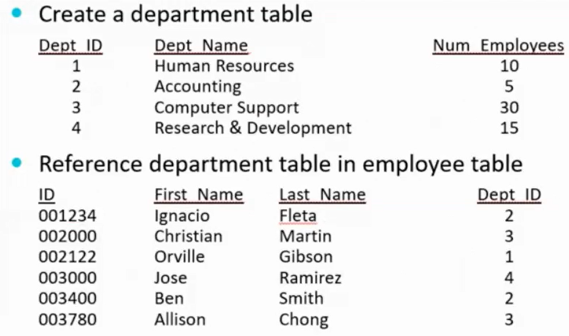

# Programming in .NET
#### by Prof. Trishan Gunness 
---
# Announcements  
---

# Today

## Topics
- Working with Databases

---

---

---

---

- Relationships!
- Avoids redundancy

---

# Data Bound C# Form Controls

- C# provides technique called data binding to link data to controls on Forms
- Components:
    - **Data Source** - usually a DB (could also be textfile, spreadsheet, webservices, etc.)
    - **Table Adapter** - pulls that from DB and passes to app (structure query lang)
    - **DataSet** - smaller in-memory copy of data that gets pulls from data tables
    - **Binding Source** - connect bound controls to the dataset
- There is wizards to help with process
- Major advantage being data is handled and things are more seamless

---
# PreReq : Provisioning Database

- We will use the Northwind database from Microsoft for this week.

- Know how to provision a database from a given SQL Script is vital

---

# DEMO

---

# Excerise

---

# END