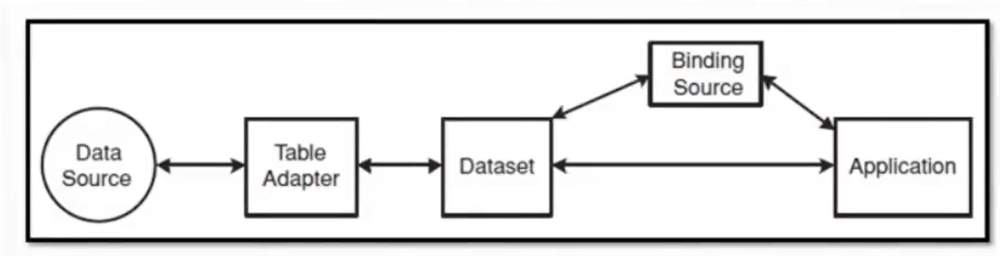

# Programming in .NET
#### by Prof. Trishan Gunness 
---
# Announcements  

- Assignment Lab 4 due **November 26th 2023 11:59pm**
- Assignment Lab 5 due **December 8th 2023 11:59pm (no late days)**
  - See ["How to upload your game to Canvas"](https://www.youtube.com/watch?v=PNpVoE8w2r8)
---

# Recap:
- Week 1 - Introduced .NET & Visual Studio
- Week 2 - Introduced C# Language
- Week 3 - Introduced Lists and LINQ
- Week 4 - OOP Fundamentals - Classes and Objects
- Week 5 - OOP Fundamentals - Relationships
- Week 6 - GUI - Forms and Events
- Week 7 - Midterm
- Week 8 Part 1 - Strings, Characters, Files & Streams, Serialization
- Week 8 Part 2 - Gaming I
- Week 9 Part 1 - Serialization, Classes File and Directory, Searching and Sorting
- Week 9 Part 2 - Gaming II
- Week 10 Part 1 - Generics
- **Week 11 - Databases**
---

# Today

## Topics
- Working with Databases

---

---

---

---

- Relationships!
- Avoids redundancy

---

# Data Bound C# Form Controls

- C# provides technique called data binding to link data to controls on Forms
- Components:
    - **Data Source** - usually a DB (could also be textfile, spreadsheet, webservices, etc.)
    - **Table Adapter** - pulls that from DB and passes to app (structure query lang)
    - **DataSet** - smaller in-memory copy of data that gets pulls from data tables
    - **Binding Source** - connect bound controls to the dataset
- There is wizards to help with process
- Major advantage being data is handled and things are more seamless

---
# PreReq : Provisioning Database

- We will use the Northwind database from Microsoft for this week.

- Know how to provision a database from a given SQL Script is vital

---

# DEMO

---

# Excerise

---

# END