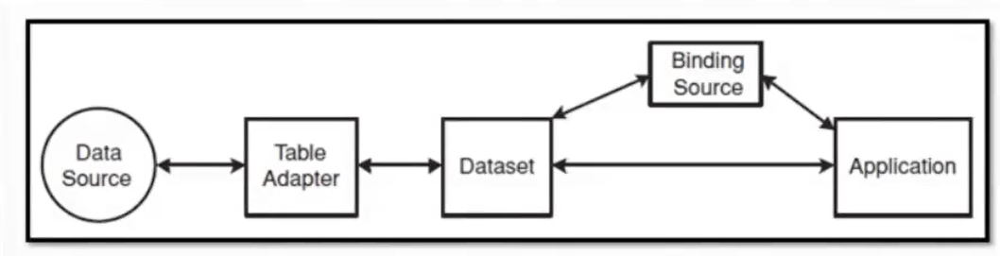

# Programming in .NET
#### by Prof. Trishan Gunness 
---
# Announcements  
---

# Today

## Topics
- ADO.NET DataAdapter vs Entity Framework

---
# RECAP: Provisioning Database

- We will use the Northwind database from Microsoft for this week.

- Know how to provision a database from a given SQL Script is vital

---
<style scoped>section { font-size: 23px; }</style>

# RECAP: Data Bound C# Form Controls

- For WinForms, C# provides technique called data binding to link data to controls
- Components:
    - **Data Source** - usually a DB (could also be textfile, spreadsheet, webservices, etc.)
    - **Table Adapter** - pulls that from DB and passes to app (structure query lang)
    - **DataSet** - smaller in-memory copy of data that gets pulls from data tables
    - **Binding Source** - connect bound controls to the dataset
---


# ADO.NET 

- ADO.NET introduces a coded way to interact with database.

- ADO.NET is a set of classes in the .NET Framework designed for data access. It provides a set of low-level, disconnected, and component-based data access libraries.

- ADO.NET uses a **connected model**, where you explicitly open a connection to the database, execute SQL commands (such as SELECT, INSERT, UPDATE, DELETE) using Command objects, and retrieve results in DataReader.

- ADO.NET gives developers fine-grained control over database interactions. It's suitable for scenarios where you need more control over SQL queries and direct access to the database.

---
# ADO.NET cont.
```csharp
static void Main(string[] args)
{
    // create the data connection
    string connectionString = "server=.\\sqlexpress;Trusted_Connection=yes;database=Northwind"; 

    // create the string to hold the SQL command 
    // to get records from the Customers table
    string commandString = "Select OrderDate, ShippedDate from Orders";

    // create the data adapter with the connection string and command
    SqlDataAdapter myDataAdapter = new SqlDataAdapter(commandString, connectionString);

    // Create and fill the DataSet object
    DataSet myDataSet = new DataSet();
    myDataAdapter.Fill(myDataSet);

    // Retrieve the Orders table
    DataTable myDataTable = myDataSet.Tables[0];

    // iterate over the rows collection and output the fields
    foreach (DataRow dataRow in myDataTable.Rows)
    {
        Console.WriteLine("Order Date: {0}. Shipped Date: {1}", dataRow["OrderDate"], dataRow["ShippedDate"]);
    }

}
```
---

# ADO.NET cont.

For more on ADO.NET please see Chapter 22 within textbook or see PowerPoint

https://mycanvas.mohawkcollege.ca/courses/92925/files/16713051


---

# Entity Framework

- Entity Framework is an Object-Relational Mapping (ORM) framework provided by Microsoft. It allows developers to work with data using .NET objects, abstracting the underlying database structure.

- EF uses a **disconnected model** and allows developers to interact with the database using a higher-level, object-oriented approach. 

- EF introduces concepts like DbContext, DbSet, and entities, enabling a more natural way of interacting with databases without dealing directly with SQL queries in code.

- EF abstracts the database schema and provides a mapping between database tables and .NET objects - increase developer productivity. It also means, you can switch databases without changing your code significantly.
---

# Choosing Between ADO.NET and Entity Framework:

- If you need fine-grained control over SQL queries, have a preference for manual database interactions, or work with legacy systems, ADO.NET might be a better fit.

- If you prefer a more object-oriented approach, want to work with a higher level of abstraction, and **value developer productivity**, Entity Framework is a good choice.

---

# DEMO - Entity Framework

---

# Exercise

Create a console application that allows user to create customer into the Northwind DB.

The main menu should look like this.

```
Customer Portal

1. List All Customers 
2. Create New Customer (prompt appear required values)
3. Delete Existing Customer
4. Exit 

Choice : 

```

---

# END