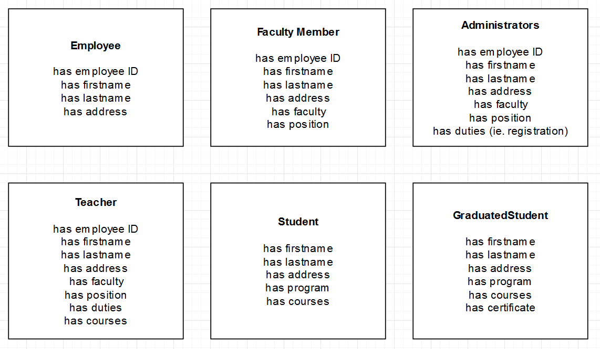
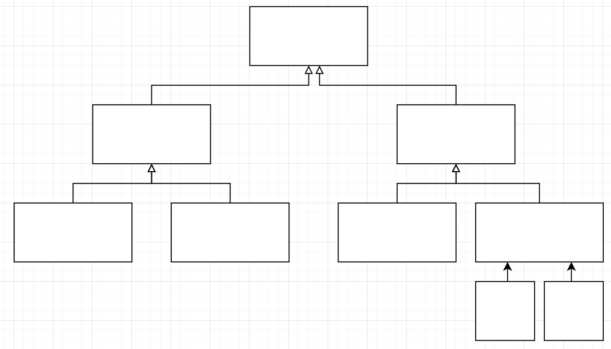
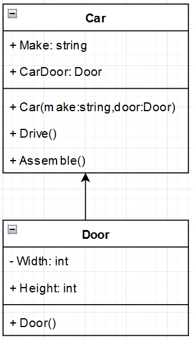
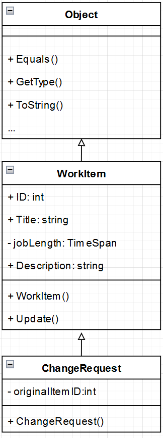

# Programming in .NET
#### by Prof. Trishan Gunness 
---
# Recap:
- Week 1- Introduced .NET & Visual Studio
- Week 2 - Introduced C# Language
- Week 3 - Introduced Lists and LINQ
- Week 4 - OOP Fundamentals - Classes and Objects
- ***Week 5 - OOP Fundamentals - Relationships***
---

# Week 5 Topics

- Part 1
  - Association
  - Inheritance
  - Abstract Classes
  - Interfaces
- Part 2
  - Polymorphism
  - Exceptions

---
# The Problem 

- In the real world many objects tend to have overlapping attributes and behaviors

- When you model your program you will see your objects also have overlapping attributes and behaviors

- This means that in code, your classes will have segments of code that repeats (ie. duplicate Properties, Methods etc.)

- Your program has reduced reusability


---
<style scoped>section { font-size: 20px; }</style>
# The Problem - Ie. School Objects



---
<style scoped>section { font-size: 20px; }</style>
# Solution - Create Relationships

- "Un-flatten" your model
- Form relationships between your objects
- Relate objects to one another
- Share attributes and behavior



---

# Relationships

In OOP, relationships are formed in a couples of ways:

- **Association** - a Class can be compose of/aggregate other classes (**HAS-A**)
  - `Car` class must have a `Door` class as a property (composition)
  - `University` class can have `Department` class as properties (aggregation)
  - Both `Car` and `University` **HAS-A** `Door` and `Department` respectfully

  
- **Inheritance** - a Class can inherit from another (**IS-A**)
  - `Teacher` class can inherit from `Employee` class
  - `Teacher` **IS-A** `Employee`

---
<style scoped>section { font-size: 20px; }</style>
# Association
- Association is used when one class is composed of or contains another class, indicating that there is a **HAS-A** relationship.
- A `Car` **HAS-A** `Door`

  ```csharp
  public class Car
  {
    public string Make { get; set; }
    public Door CarDoor { get; set; }
    public Car(string make, Door door) 
    {
      Make = make;
      CarDoor = door;
    }
    public void Drive() {/*todo*/}
    public void Assembly() {/*todo*/}
  }
  
  public class Door
  {
    private int Width {get; set;}
    private int Height {get; set;}
    public Door() {Width=20;Height=30;}
  }
  ```



*note the arrows in UML diagram

---
# Inheritance

- Inheritance allows a new class to absorb an existing class’s members.
- A **Derived** Class is a class that inherits
- A Derived Class inherits from a **Base** Class
- A Derived Class will also inherit from **Indirect Base** Class 
  - Indirect Base Class is any class above the direct base class in the class hierarchy

- A Derived Class normally adds its own fields and methods to represent a more specialized group of objects.
- As you go down the class hierarchy, you get more specialized or more specific
- A DERIVED CLASS CAN ONLY INHERIT FROM ONE BASE CLASS (more on this later)


---
<style scoped>section { font-size: 15px; }</style>


<br/><br/><br/><br/><br/><br/><br/><br/><br/><br/><br/><br/><br/><br/><br/>
*note the arrows in UML diagram

---
# Inheritance - Code

```csharp

public class WorkItem : Object //inheriting from Object is done by compiler so not needed
{
  public WorkItem(){}
  public int ID {get;set;}
  public string Title {get;set;}
  public string Description {get;set;}
  private TimeSpan jobLength;
}

public class ChangeRequest : WorkItem
{
  public ChangeRequest(){}
  private int originalItemID;
}

```
---


---
# Abstract Class
- An Abstract Class is intended for inheritance only
- An Abstract Class is a type of Class method to only be Base Class (aka Abstract Base Class)
- Abstract Class must be inherited from, you can not instantiate an Abstract Class
  - `var x = new MyAbstractClass()` not allowed
- **An Abstract Class contains concrete Methods and abstract Methods**
  - Abstract Methods contain no concrete implementation.
  - Derived classes must provide implementations for these methods
- **An Abstract Class contains concrete Properties and abstract Properties**
  - Abstract Properties contain no concrete implementation.
  - Derived classes must provide implementations for these properties.

---

# Abstract Class - real world example

A Shape can be seen as an abstract object.

- Every Shape has an Area and Color attribute
- Color is something concrete per Shape
- Area on the other hand is dependant on the derived type.
  - How you calculate Area for a Square differs from a Circle.
- You can say Area is common to all shapes but force derived class to add implementation

---

# Abstract Class - Code

```csharp
public abstract class Shape
{
  public string Color {get;set;}
  public int Length {get;set;}
  public int Width {get;set;}
  public Shape(int length, int width, string color)
  {
    Length = length;
    Width = width;
    Color = color;
  }
  public abstract CalculateArea();//no implementation
}

public class Square : Shape
{
  public override CalculateArea()
  {
    return Length * Length;
  }
}

public class Rectangle : Shape
{
  public override CalculateArea()
  {
    return Length * Width;
  }
}

```
---
# Interfaces 

- Interfaces are similar to Abstract Class, must be inherited, **BUT contains no concrete Properties and Methods**
- Interfaces forces the Derived Class to implement everything!
- Interfaces is 100% abstraction
- Interfaces are a great way to establish a "contract" by types
- A Derived Class can inherit from multiple Interfaces
- Access modifiers aren't enforceable

---
# Interface - Code

```csharp

public interface IDrawable
{
  void Draw();
}

public class Circle : IDrawable
{
  public void Draw()
  {
    //add implementation
  }
}

```
---
# Interface - Multiple Inheritance  

```csharp

public interface IDrawable
{
  void Draw();
}

public interface IPaintable
{
  void Paint();
}

public class Circle : IDrawable, IPaintable
{
  public void Draw()
  {
    //add implementation
  }
  public void Paint()
  {
    //add implementation
  }
}

```
---

# Abstract and Interface - When to use

Use an abstract class when you want to provide a base structure with some shared code and fields for related classes. 

Use an interface when you want to define a contract specifying what derived classes must implement without providing any shared code.


---
<style scoped>section { font-size: 20px; }</style>
# Exercise - School Objects

You are given a set of objects within a School. You are to create relationships between them (using Association, Inheritance, Abstract Classes and Interfaces).

1. Create a UML diagram for these objects (be sure to use correct arrows)
2. Create  the classes in code


---

# Conclusion

- Learnt about Relationships
  - Association
  - Inheritance
  - Abstract Classes
  - Interfaces

- Next Class: We go deeper on the utility of relationship, with Polymorphism 
- Next Class: We learn about Exceptions


--- 


<style scoped>section { display: none; }</style>

Topics:
Part 1:
- inheritance
  - base class (ultimate base class Object)
  - derived class
  - protected members
  - Constructors in Derived Classes
  - Demo
    - BasePlusCommissionEmployee
    - CommissionEmployee
  - Benefits in Software Engineering
  - In Class Exercise

- abstract classes
  - can't be instantiated

- interfaces

- In Class Exercise