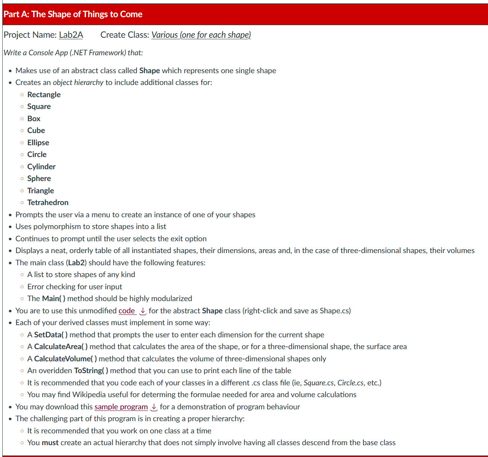

# Programming in .NET
#### by Prof. Trishan Gunness 
---
# Recap:
- Week 1- Introduced .NET & Visual Studio
- Week 2 - Introduced C# Language
- Week 3 - Introduced Lists and LINQ
- Week 4 - OOP Fundamentals - Classes and Objects
- ***Week 5 - OOP Fundamentals - Relationships***
---
# Recap Last Class

---

# Recap - Relationships

In real world and OOP, many objects have overlapping attributes and behaviors. 

We can form relationships in code to reduce code complexity and increase maintainability.

---
# Recap - Relationships in Code
In OOP, relationship is formed in a couple of ways

- Association
- Inheritance
  - Base Class
  - Abstract Class
  - Interface

---

# Recap - Association

When a class is composed of, or aggregates, other classes this is known as Association

Association represents the "HAS-A" relationship.

`Car` class "HAS-A" `Door` class
`University` class "HAS-A" `Department` class

---

# Recap - Association Code

```csharp
public class Car
{
public string Make { get; set; }
public Door CarDoor { get; set; }
public Car(string make, Door door) 
{
    Make = make;
    CarDoor = door;
}
public void Drive() {/*todo*/}
public void Assembly() {/*todo*/}
}

public class Door
{
private int Width {get; set;}
private int Height {get; set;}
public Door() {Width=20;Height=30;}
}
```
---

# Recap - Inheritance

When a class absorbs (inherits) an existing class's properties and methods, this is known as Inheritance

Inheritance represents the "IS-A" relationship.

`Teacher` "IS-A" `Employee`, and it can inherit properties like `EmployeeId`

---
# Recap - Inheritance Code

```csharp
public class Employee //inheriting from Object is done by compiler so not needed
{
  public Employee(){}
  public Employee(int ID) 
  { 
    /*...*/
  }
  public int EmployeeID {get;set;}
  public string FirstName {get;set;}
  public string LastName {get;set;}
}

public class Teacher : Employee
{
  public Teacher() {}
  public Teacher(int ID, string Faculty ) : base(ID) //base calls the base class constructor
  { 
    /*...*/  
  }
  private string Faculty {get; set;};
}
```
---

# Recap - Abstract Class and Interface

A Class can inherit from regular Class, but it can also inherit from Abstract Class or Interface

- **Regular Class** - derived class inherit all properties, methods, but can't override behavior in base class
- **Abstract Class** - derived class inherit properties, methods, but must add implementation to abstract elements in base class (ie. `public abstract int GetDate();`)
- **Interface** - derived class inherit no properties, methods, but must add implementation to everything defined in the interface 

---

# Recap - Abstract Class Code

```csharp
public abstract class Shape
{
  public string Color {get;set;}
  public int Length {get;set;}
  public int Width {get;set;}
  public abstract int CalculateArea();//no implementation
}

public class Rectangle : Shape
{
  public override int CalculateArea()
  {
    return Length * Width;
  }
}

```
---

# Recap - Interface Code

```csharp
public interface IDrawable
{
  void Draw();
}

public class Circle : IDrawable
{
  public void Draw()
  {
    //add implementation
  }
}
```
---

# Recap - Abstract and Interface - When to use

Use an **abstract class** when you want to provide a base structure with some shared code and fields for related classes. 

Use an **interface** when you want to define a contract specifying what derived classes must implement without providing any shared code.

---
# Today
- Multiple Inheritance 
- Polymorphism
- Exceptions


---
<style scoped>section { font-size: 20px; }</style>
# Multiple Inheritance 

You can only inherit from a Single Class (concrete or abstract) and you can and multiple Interfaces

```csharp 
    public class Employee : Person, IPayable, ITerminate
    {
        public Employee(string firstname, string lastname, int employeeId) : base(firstname, lastname)
        {
            EmployeeID = employeeId;
        }

        public int EmployeeID { get; set; }

        public override string ToString()
        {
            return $"Employee Details: " +
                   $"Firstname: {base.FirstName} " + //prop from Person
                   $"Lastname: {base.LastName} " + //prop from Person
                   $"EmployeeId: {this.EmployeeID}"; //prop from Employee
        }        

        public void Pay() //from IPayable
        {
            Console.WriteLine("Paid!");
        }

        public bool SaveVoidChequeu(object cheque) //from IPayable
        {
            Console.WriteLine("Saved bank information");
            return true;
        }

        public void TerminateEmployment() //from ITerminate
        {
            Console.WriteLine("Employment has ended.");
        }
    }

```
---

# Polymorphism

- Polymorphism is a Greek word that means “many shaped”.

- In OOP, **Polymorphism is the ability of an object to take on many forms**

- Any object that can pass the IS-A test, is considered to be polymorphic.

```csharp
public interface IFeedable { }
public class Animal { }
public class Deer : Animal, IFeedable { }
```

A `Deer` IS-A `Animal`
A `Deer` IS-A `IFeedable`
A `Deer` IS-A `Deer`
A `Deer` IS-A `Object`

**-->`Deer` is considered to be polymorphic<--**

---

# Polymorphism - So What!?!

- Polymorphism is a powerful concept that allows polymorphic objects to be treated as any of their base or indirect base class, or any of their interfaces.

```csharp

Animal deer = new Deer();
IVegetarian deer2 = new Deer();
Object deer3 = new Deer(); //everything IS-A a Object type
```

###### ...demo

---
# Polymorphism Code Demo - My Animals
---

# Polymorphism - Benefit

Polymorphism in C# allows for code reusability, flexibility, and simplified maintenance by enabling objects of different classes to be treated uniformly, promoting clean code design.


---

# QUICK BREAK 
...new topic up next

---

# Exceptions and Exception Handling

- An exception is an abnormal or unexpected event that occurs during the execution of a program that abrupt the execution of code.
  - Divide by zero, null object reference, file not found, etc. all violate normal execution.

- Whenever an exception occurs the .NET Runtime triggers an event that halts execution, an `Exception` object is created and this Exception object is **"thrown"**

- The `Exception` object container information about the event, include type, message, stack trace, and additional information
  - Stack Trace: shows the order, chain, of method calls and their location in code when the exception occurs

---
# Exception Demo

```csharp 
public string CalculateAge()
{
    int convertedAge = 10 / _age; //could throw exception depending on _age
    return $"Cat is {convertedAge} years old";
}
```
###### ...demo
---
# Exception Handling

- C# provides try-catch blocks to allows for graceful error recovery and prevention of program crashes.
- Code that might throw an exception is placed in the `try` block
- Exception types can be caught and handled in associated `catch` blocks. 

---
# Exception Handling - try catch


```csharp 
public string CalculateAge()
{
  try
  {
    int convertedAge = 10 / _age; //could throw exception depending on _age
    return $"Cat is {convertedAge} years old";
  }
  catch(Exception e)
  {
    Console.WriteLine("error occurred");
    return "age unknown";
  }
}
```
---

# Exception Handling - try with multiple catch

```csharp 
public string CalculateAge()
{
    try
    {
        int convertedAge = 10 / _age;
        return $"Cat is {convertedAge} years old";
    }
    catch(DivideByZeroException e)
    {
        return "unknown due to divide zero";
    }
    catch(ArgumentException e)
    {
        return "unknown due to invalid arg";
    }
    catch(Exception e)
    {
        return "unknown, for reasons unknown";
    }
}
```
---
# Exception Handling - try catch finally

- `finally` block allows you to clean up or release resources in a single spot (don't need to add to try and add to catch)
```csharp 
public string CalculateAge()
{
    try
    {
        int convertedAge = 10 / _age;
        return $"Cat is {convertedAge} years old";
    }
    catch(DivideByZeroException e)
    {
        return "unknown due to divide zero";
    }
    finally
    {
      //code in here is always called 
    }
}
```


---

# Throwing Exceptions

- Sometimes its advantageous to halt execution yourself (ie. you got invalid results after calculation or invalid arguments). 

- You can `throw` an exception

```csharp
public Cat(int age)
{
    if (age == 0)
        throw new ArgumentException("age can not be zero");

    _age = age;
}
```

---
# Creating Custom Exception

- You can make your own Exception using Inheritance!

```csharp
public class InvalidAnimalException : Exception
{
    public string ProblematicAnimal;
    public InvalidAnimalException() { }
    public InvalidAnimalException(string message) : base(message) { }
    public InvalidAnimalException(string message, string animal) : base(message) 
    {
        ProblematicAnimal = animal;
    }
}
```
```csharp
    if (age == 0)
        throw new InvalidAnimalException("age can not be zero", "Cat");
    _age = age;
```
---

# Exceptions - Best Practices 

- Use try/catch/finally blocks to recover from errors or release resources
- Handle common conditions without throwing exceptions
- Design classes so that exceptions can be avoided
- Throw exceptions instead of returning an error code/string
- Use the predefined .NET exception types as much as possible
- End exception class names with the word Exception
- Include three constructors in custom exception classes
- Ensure that exception data is available when code executes remotely
- Use grammatically correct error messages
- In custom exceptions, provide additional properties as needed


###### https://learn.microsoft.com/en-us/dotnet/standard/exceptions/best-practices-for-exceptions


---
# Exercise - Lab 2 Assignment

- Now that we've hit end of Week 5, you're equipped with all knowledge required to complete Lab Assignment 2

- We will leave the reminder of class to work on Part 1 or Part 2 of this assignment.
  - Note: we'll take a deeper look at GUI next Modulethat aids with Part 2
---




---
# Conclusion

- This Moduleconcludes the "Fundamentals of OOP".
- Topics we touch include:
  - Classes and Objects
  - Association
  - Inheritance
    - Base Class
    - Abstract Class
    - Interface
  - Polymorphism
- We showed how these OOP fundamentals can reduce code complexity, increase reusability and maintainability.

 
--- 
# End


