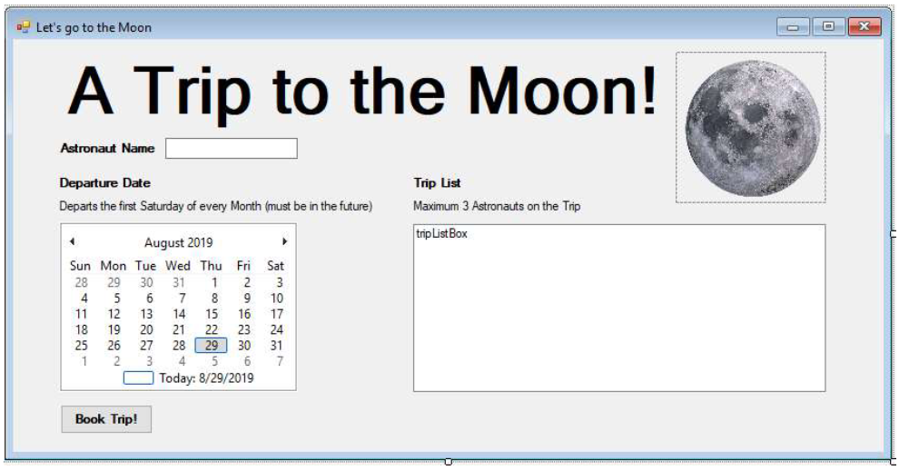

# Programming in .NET
#### by Prof. Trishan Gunness 
---
# Announcements  
---

# Today
## GUI - Forms and Events

---
# GUI - Forms and Events

- Why use GUI?
- What is WinForm app?
  - Concepts learnt in winforms are transferrable to WPF, Xamarin, etc.  
  - Event driven architecture
- How are GUI built in .NET?

---

# GUI - Demo

1. Create your first Winform app
2. Show the relevant Visual Studio sections
    - Designer 
    - Toolbox
    - Properties
    - Solution Explorer
3. Demo adding some Controls to Form
    - Label
    - TextBox
    - Button
    - RadioButton
    - MonthCalendar
4. Demo adding Events to some Controls

---

# Exercise - Let's Go to  the Moon
See exercise [here](https://mycanvas.mohawkcollege.ca/courses/92925/files/16712995?module_item_id=4763007)

---
# Recap

Today:
- Learnt how to create WinForm application using VS designer 
- Learnt some basic UI controls
- Learnt how to attach event listeners (delegates) to UI controls

Next Class:
- Cover some more controls and layout
- Cover multi-form WinForm app

---

# END