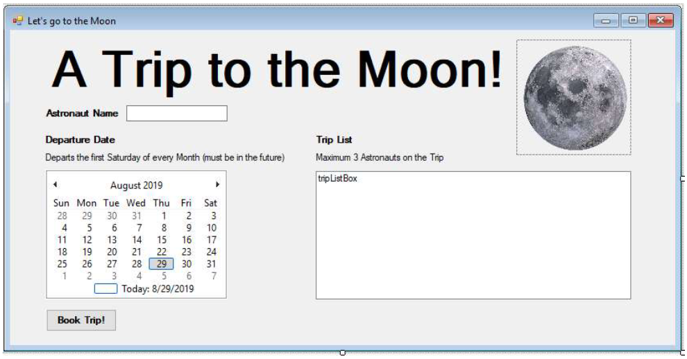
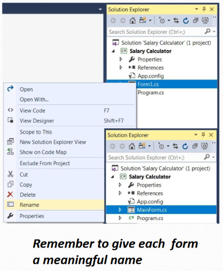
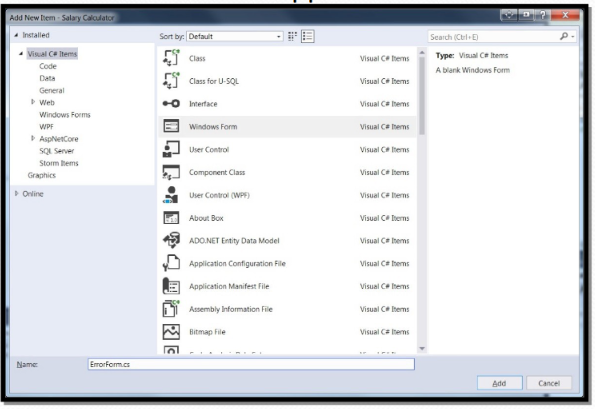
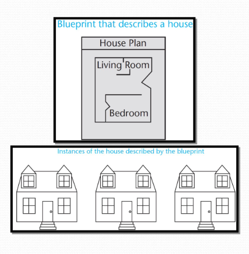
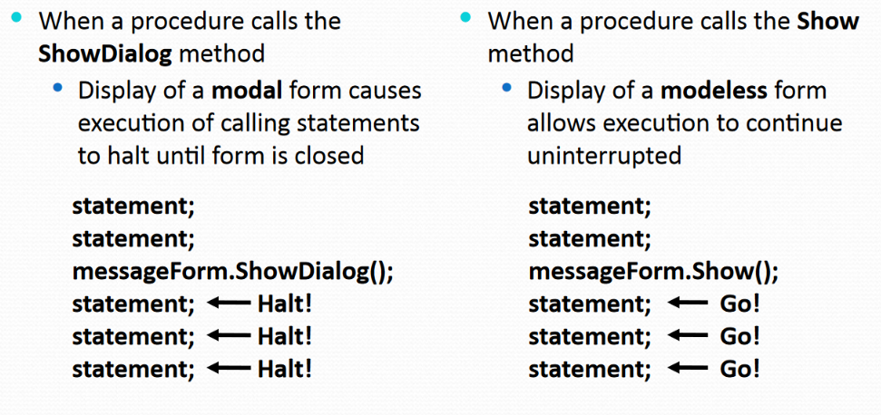
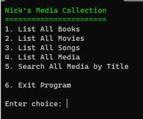
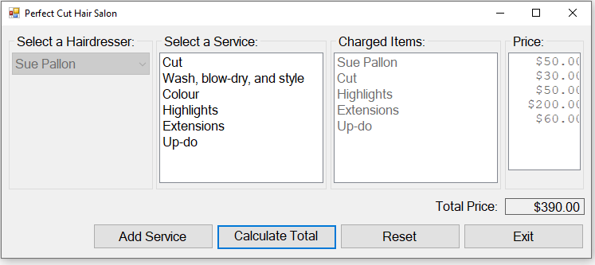

# Programming in .NET
#### by Prof. Trishan Gunness 
---
# Announcements  

- Assignment Lab 2 due <span style="color:red;">March 10th 2024 11:59pm</span>

- Midterm will be on <span style="color:red;">March 14th</span>
    - Will be done in the classroom, on lab computer
    - Please bring student cards with you (ie. proof of ID)
    - **Will cover everything up to and including GUI**

- Assignment Lab 3 available today, <span style="color:red;">due March 24th 11:59pm</span>
---

# Recap:
- Week 1 - Introduced .NET & Visual Studio
- Week 2 - Introduced C# Language
- Week 3 - Introduced Lists and LINQ
- Week 4 - OOP Fundamentals - Classes and Objects
- Week 5 - OOP Fundamentals - Relationships
- **Week 6 - GUI - Forms and Events**
---

# Recap Last Class - GUI Forms and Events

1. Created your first Winform app
2. Shown Visual Studio sections (Designer, Toolbox, Properties)
3. Introduced some Controls
    - Label
    - TextBox
    - Button
    - RadioButton
    - MonthCalendar
4. Introduced Events

---

# Recap Last Class - Exercise Solution

 Let's Go to  the Moon



---

# Today

- Controls
  - `MessageBox`, a quick way to get UI alerts
  - `GroupBox`, and how it makes design easier (and how it makes queries faster)
  - `CheckBox`, and how they're used
  - `ComboBox`, and how they're used
  - `ListBox`, and how they interact with Objects
  
- Multi-Form Apps
- Introduce Lab 3
- Exercise!

---
# `GroupBox` Demo
---
# `CheckBox` Demo
---
# `ComboBox` Demo
---
# `ListBox` Demo
---
# Multiple Form Applications

- Windows Forms applications are not limited to only a single form
- You may create multiple forms
  - To expand the UI
  - To use as dialog boxes
  - Display error messages
  - etc.
---
<style scoped>section { font-size: 25px; }</style>
# Form Files and Form Names

- Each form has a `Name` property
  - Set to `Form1` by default
- You can rename Form1 to another name
- To rename a form file:
  - Right-click file name in Solution Explorer
  - Select Rename from the menu
  - Type the new name for the form
  - Be sure to keep the .cs extension 

  
---
<style scoped>section { font-size: 25px; }</style>
# Add a New Form to a Project

- To add a new form to a project:
  - Click **Project** on the Visual Studio menu bar, and then select Add **Windows Form** . . . The **Add New Item** window appears
  - Enter the new Name in the Name text box
  - Click the Add button

  
---
<style scoped>section { font-size: 25px; }</style>
# Form Designs are Blueprints

- VS Form Designer creates/updates a class, and as we know, classes are Blueprints to real world object
- As such, your Form Design is a blueprint
- You can use Form Design to create instances of the form

`HouseForm form1 = new HouseForm();`
`StudentForm form2 = new StudentForm();`
`ErrorForm form3 = new ErrorForm();`



---
# Form Display

- creating instance of a Form does not cause the form to be displayed on the screen
- `.ShowDialog()` causes form to be displayed as a modal form
  ```csharp
  StudentForm form2 = new StudentForm();
  form2.ShowDialog();
  ```
- `.Show()` causes form to be displayed as modeless form
  ```csharp
  HouseForm form2 = new HouseForm();
  form2.Show();
  ```
---
# Modal and Modeless Forms



---

# Form `.Hide()` and `.Close()`

- `.Hide()`
  - Makes form invisible
  - Does not remove it from memory
  - Similar to setting Visible property to False
- `.Close()`
  - Closes a form 
  - Remove it from memory

---
# Load Event

- Load event is triggered just before the form is initially displayed
- Any code needed to prepare the form prior to display should be in the Load event
- Works the same way as other event delegates

```csharp
private void MainForm_Load(object sender, EventArgs e)
{

}

```
---
# Multiple Form Demo
---

# Break - 5mins

--- 

# Assignment Lab 3 - Introduction

- Due March 24th 2024

---
<style scoped>section { font-size: 20px; }</style>
# Assignment Lab 3 - Part 1


- Create a console app that allows user to list and search media (books, movies and songs) 
- Sample provided on MyCanvas
  - download `Lab3A.exe` and `Data.txt`
  - run in cmd prompt `Lab3A.exe Data.txt`
- `Media` abstract class provided
  - create derived class `Book` `Movie` `Song`
- `IEncryptable` interface provided
  - `Book` and `Movies` will implement
  - Data file has Summary encrypted using Rot13 (see Wikipedia)
- `ISearchable` interface provided
  - all media types are searchable

- [**Full details on MyCanvas**](https://mycanvas.mohawkcollege.ca/courses/92925/pages/lab-assignment-3)


---
# Assignment Lab 3 - Part 2 



- similar to Lab 2 Part 2, calculate Hair Salon's cost
- Sample provided on MyCanvas
- Makes use of Groupbox, Combobox, ListBox, Button, etc.
- [**Full details on MyCanvas**](https://mycanvas.mohawkcollege.ca/courses/92925/pages/lab-assignment-3)

***NOTE: Midterm has one GUI question that is similar to the GUI in Lab 2 & Lab3***


---

# Today's InClass Exercise

Create Form Design for Lab 3 Part 2


--- 
# Conclusion

- Controls
  - `MessageBox`, a quick way to get UI alerts
  - `GroupBox`, and how it makes design easier (and how it makes queries faster)
  - `CheckBox`, and how they're used
  - `ComboBox`, and how they're used
  - `ListBox`, and how they interact with Objects 
- Multi-Form Apps

---
# Next Week

- Monday - Midterm Review
- Wednesday - Midterm

---

# END