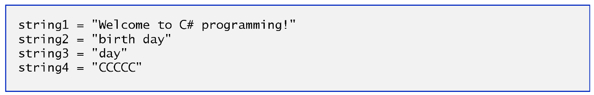
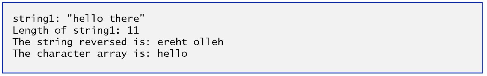
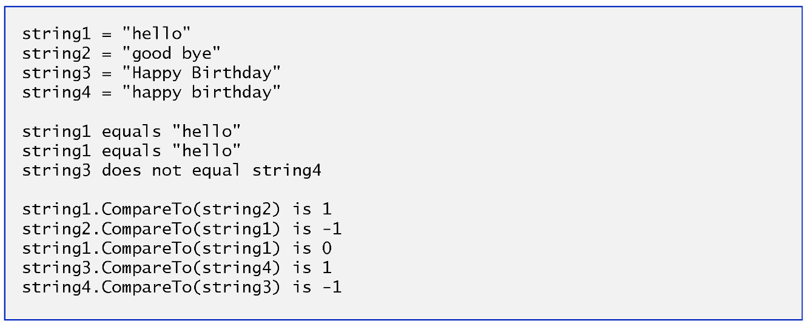
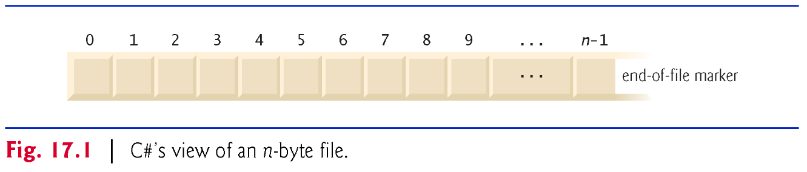

# Programming in .NET
#### by Prof. Trishan Gunness 
---
# Announcements  

- Assignment Lab 3 due <span style="color:red;">November 16th 2023 11:59pm</span>

- Lab 1 & 2 Grades - will be posted by end of this week

- Midterm Grades - will be posted by Nov 17th

---
<style scoped>section { font-size: 22px; }</style>
# Recap:
- Week 1 - Introduced .NET & Visual Studio
- Week 2 - Introduced C# Language
- Week 3 - Introduced Lists and LINQ
- Week 4 - OOP Fundamentals - Classes and Objects
- Week 5 - OOP Fundamentals - Relationships
- Week 6 - GUI - Forms and Events
- Week 7 - Midterm 
<b>
- Week 8
  - Part 1 -
    - Strings
    - Characters
    - Files & Streams
    - Serialization
    - ~~Events & Delegates~~ (lots to cover here, moving to Week 9.1)
    - ~~Classes File and Directory~~ (moving to Week 9.1)
  - Part 2 
    - Gaming I
</b>

---
# Week 8 Part 1 

## Strings, Characters, Files & Streams

---
# `string` - A Deeper Look

---
# `string` Constructors

```csharp
static void Main()
{
  // string initialization                             
  char[] characterArray =
      {'b', 'i', 'r', 't', 'h', ' ', 'd', 'a', 'y'};
  var originalString = "Welcome to C# programming!";
  var string1 = originalString;
  var string2 = new string(characterArray);
  var string3 = new string(characterArray, 6, 3);
  var string4 = new string('C', 5);

  Console.WriteLine($"string1 = \"{string1}\"\n" +
      $"string2 = \"{string2}\"\n" +
      $"string3 = \"{string3}\"\n" +
      $"string4 = \"{string4}\"\n");
}
```

**What do you think the output will be?**

---
# `string` Constructors


---
# `string` Indexer, Length, & CopyTo

- `string` can be treated and thought of as an array
  - It has Index (indexer) `"helloworld".Index[0]`
  - It has length property `"helloworld".Length`
  - It can be iterated `foreach(char x in "helloworld")`
  - It can be make use of Array.CopyTo `"helloworld".CopyTo(___)`

---
# `string` Indexer, Length, & CopyTo
```csharp
static void Main()
{
  var string1 = "hello there";
  var characterArray = new char[5];

  Console.WriteLine($"string1: \"{string1}\""); // output string1

  // test Length property                                     
  Console.WriteLine($"Length of string1: {string1.Length}");

  // loop through characters in string1 and display reversed
  Console.Write("The string reversed is: ");

  for (int i = string1.Length - 1; i >= 0; --i)
  {
      Console.Write(string1[i]);
  }

  // copy characters from string1 into characterArray           
  string1.CopyTo(0, characterArray, 0, characterArray.Length);
  Console.Write("\nThe character array is: ");

  foreach (var element in characterArray)
  {
      Console.Write(element);
  }

  Console.WriteLine("\n");
}
```
---
# `string` Indexer, Length, & CopyTo


---
# Locating characters and substrings in `strings`
- Seeing `string` as array helps with search and extraction of substrings

- Its regularly necessary to search for a character or set of characters in `string`
  - For example, a programmer creating a word processor would want to provide capabilities for searching through documents.

- `IndexOf`, `IndexOfAny`, `LastIndexOf` and `LastIndexOfAny` are some method that can help searching  for a specified character or substring in a string

---
# Locating characters and substrings in `strings`
```csharp
static void Main()
   {
      var letters = "abcdefghijklmabcdefghijklm";
      char[] searchLetters = {'c', 'a', '$'};

      // test IndexOf to locate a character in a string
      Console.WriteLine($"First 'c' is located at index " +
          letters.IndexOf('c'));
      Console.WriteLine("First 'a' starting at 1 is located at index " +
         letters.IndexOf('a', 1));
      Console.WriteLine("First '$' in the 5 positions starting at 3 " +
         $"is located at index " + letters.IndexOf('$', 3, 5));

      // test LastIndexOf to find a character in a string
      Console.WriteLine($"\nLast 'c' is located at index " +
         letters.LastIndexOf('c'));
      Console.WriteLine("Last 'a' up to position 25 is located at " +
         "index " + letters.LastIndexOf('a', 25));
      Console.WriteLine("Last '$' in the 5 positions ending at 15 " +
         "is located at index " + letters.LastIndexOf('$', 15, 5));

      // test IndexOf to locate a substring in a string
      Console.WriteLine("\nFirst \"def\" is located at index " +
         letters.IndexOf("def"));
      Console.WriteLine("First \"def\" starting at 7 is located at " +
         "index " + letters.IndexOf("def", 7));
      Console.WriteLine("First \"hello\" in the 15 positions " +
         "starting at 5 is located at index " +
         letters.IndexOf("hello", 5, 15));

      // test LastIndexOf to find a substring in a string
      Console.WriteLine("\nLast \"def\" is located at index " +
         letters.LastIndexOf("def"));
      Console.WriteLine("Last \"def\" up to position 25 is located " +
         "at index " + letters.LastIndexOf("def", 25));
      Console.WriteLine("Last \"hello\" in the 15 positions " +
         "ending at 20 is located at index " +
         letters.LastIndexOf("hello", 20, 15));

      // test IndexOfAny to find first occurrence of character in array
      Console.WriteLine("\nFirst 'c', 'a' or '$' is " +
         "located at index " + letters.IndexOfAny(searchLetters));
      Console.WriteLine("First 'c', 'a' or '$' starting at 7 is " +
         "located at index " + letters.IndexOfAny(searchLetters, 7));
      Console.WriteLine("First 'c', 'a' or '$' in the 5 positions " +
         "starting at 7 is located at index " +
         letters.IndexOfAny(searchLetters, 7, 5));

      // test LastIndexOfAny to find last occurrence of character
      // in array
      Console.WriteLine("\nLast 'c', 'a' or '$' is " +
         "located at index " + letters.LastIndexOfAny(searchLetters));
      Console.WriteLine("Last 'c', 'a' or '$' up to position 1 is " +
         "located at index " +
         letters.LastIndexOfAny(searchLetters, 1));
      Console.WriteLine("Last 'c', 'a' or '$' in the 5 positions " +
         "ending at 25 is located at index " +
         letters.LastIndexOfAny(searchLetters, 25, 5));
   }
```
---
# Extracting substrings from `string`

- Class `string` provides two Substring methods, which create a new string by copying part of an existing string.
- Each method returns a new `string`
---
# Extracting substrings from `string`
```csharp
static void Main()
{
  var letters = "abcdefghijklmabcdefghijklm";

  // invoke Substring method and pass it one parameter
  Console.WriteLine("Substring from index 20 to end is " +
      $"\"{letters.Substring(20)}\"");

  // invoke Substring method and pass it two parameters
  Console.WriteLine("Substring from index 0 of length 6 is " +
      $"\"{letters.Substring(0, 6)}\"");
}
```
---
# Comparing `string`
- Class `string` provides several ways to compare strings.
- Method `Equals`, method `CompareTo` and the equality operator (`==`)
  - Use `==` for checking if two string references point to the same memory location.
  - Use `.Equals` for comparing the actual content of strings.
  - Use `.CompareTo` for determining the order of strings, especially when you need to sort 
    ```csharp
    string str1 = "apple";
    string str2 = "banana";
    int comparisonResult = str1.CompareTo(str2); // Returns a negative value since "apple" comes before "banana"
     ```
---
# Comparing `string`
```csharp
static void Main()
{
  var string1 = "hello";
  var string2 = "good bye";
  var string3 = "Happy Birthday";
  var string4 = "happy birthday";

  // output values of four strings
  Console.WriteLine($"string1 = \"{string1}\"" +
      $"\nstring2 = \"{string2}\"" +
      $"\nstring3 = \"{string3}\"" +
      $"\nstring4 = \"{string4}\"\n");

  // test for equality using Equals method
  if (string1.Equals("hello"))
  { 
      Console.WriteLine("string1 equals \"hello\"");
  }
  else
  { 
      Console.WriteLine("string1 does not equal \"hello\"");
  }

  // test for equality with ==
  if (string1 == "hello")
  {
      Console.WriteLine("string1 equals \"hello\"");
  }
  else
  {
      Console.WriteLine("string1 does not equal \"hello\"");
  }

  // test for equality comparing case
  if (string.Equals(string3, string4)) // static method
  {
      Console.WriteLine("string3 equals string4");
  }
  else
  {
      Console.WriteLine("string3 does not equal string4");
  }

  // test CompareTo
  Console.WriteLine(
      $"\nstring1.CompareTo(string2) is {string1.CompareTo(string2)}");
  Console.WriteLine(
      $"string2.CompareTo(string1) is {string2.CompareTo(string1)}");
  Console.WriteLine(
      $"string1.CompareTo(string1) is {string1.CompareTo(string1)}");
  Console.WriteLine(
      $"string3.CompareTo(string4) is {string3.CompareTo(string4)}");
  Console.WriteLine(
      $"string4.CompareTo(string3) is {string4.CompareTo(string3)}");
}
```
---
# Comparing `string`


---
# StringBuilder
- String is an immutable type. That is, each operation that appears to modify a String object actually creates a new string.
  - Example: If you call `String.Concat`, what happens is memory allocated, new value put into memory, and variable reassigned the new memory location. Original never changed.

- For routines that perform extensive string manipulation (such as apps that modify a string numerous times in a loop), modifying a string repeatedly can exact a significant performance penalty.

- The alternative is to use `StringBuilder`

ref: https://learn.microsoft.com/en-us/dotnet/api/system.text.stringbuilder?view=net-7.0#HowWorks

---
# StringBuilder
```csharp
using System;
using System.Reflection;
using System.Text;

public class Example
{
   public static void Main()
   {
      StringBuilder sb = new StringBuilder();
      ShowSBInfo(sb);
      sb.Append("This is a sentence.");
      ShowSBInfo(sb);
      for (int ctr = 0; ctr <= 10; ctr++) {
         sb.Append("This is an additional sentence.");
         ShowSBInfo(sb);
      }   
   }
   
   private static void ShowSBInfo(StringBuilder sb)
   {
      foreach (var prop in sb.GetType().GetProperties()) {
         if (prop.GetIndexParameters().Length == 0)
            Console.Write("{0}: {1:N0}    ", prop.Name, prop.GetValue(sb));
      }
      Console.WriteLine();
   }
}
// The example displays the following output:
//    Capacity: 16    MaxCapacity: 2,147,483,647    Length: 0
//    Capacity: 32    MaxCapacity: 2,147,483,647    Length: 19
//    Capacity: 64    MaxCapacity: 2,147,483,647    Length: 50
//    Capacity: 128    MaxCapacity: 2,147,483,647    Length: 81
```
---
# StringBuilder

- Every StringBuilder can store a certain number of characters that’s specified by its capacity.
- Exceeding the capacity of a StringBuilder causes the capacity to expand to accommodate the additional characters

---

# Misc. `string` methods

- Class string provides several methods that return modified copies of strings.
  - `Replace`
  - `ToLower`
  - `ToUpper`
  - `Trim`
--- 
# Misc. `string` methods
```csharp
  static void Main()
   {
      var string1 = "cheers!";
      var string2 = "GOOD BYE ";
      var string3 = "   spaces   ";

      Console.WriteLine($"string1 = \"{string1}\"\n" +
         $"string2 = \"{string2}\"\n" +
         $"string3 = \"{string3}\"");

      // call method Replace
      Console.WriteLine("\nReplacing \"e\" with \"E\" in string1: " +
         $"\"{string1.Replace('e', 'E')}\"");

      // call ToLower and ToUpper
      Console.WriteLine(
         $"\nstring1.ToUpper() = \"{string1.ToUpper()}\"" +
         $"\nstring2.ToLower() = \"{string2.ToLower()}\"");

      // call Trim method
      Console.WriteLine(
         $"\nstring3 after trim = \"{string3.Trim()}\"");

      Console.WriteLine($"\nstring1 = \"{string1}\"");
   }
```
---
# `char` methods

- Class char provides useful method to help in conversions on characters

```csharp
 static void Main(string[] args)
  {
    Console.Write("Enter a character: ");
    var character = char.Parse(Console.ReadLine());

    Console.WriteLine($"is digit: {char.IsDigit(character)}");
    Console.WriteLine($"is letter: {char.IsLetter(character)}");
    Console.WriteLine(
        $"is letter or digit: {char.IsLetterOrDigit(character)}");
    Console.WriteLine($"is lower case: {char.IsLower(character)}");
    Console.WriteLine($"is upper case: {char.IsUpper(character)}");
    Console.WriteLine($"to upper case: {char.ToUpper(character)}");
    Console.WriteLine($"to lower case: {char.ToLower(character)}");
    Console.WriteLine(
        $"is punctuation: {char.IsPunctuation(character)}");
    Console.WriteLine($"is symbol: {char.IsSymbol(character)}");
  }
```
---
# Files and Streams

---
# Recap - Stream Class

- C# has Stream abstract class which provides standard method to transfer bytes (read, write, etc.) to a source.

- Concrete Stream classes include:
  - FileStream - files
  - MemoryStream - memory
  - BufferedStream - works with other streams to improve performance
  - NetworkStream - network sockets

---

# Recap - FileStream

`FileStream file = new FileStream("path.txt", FileMode, FileAccess, FileShare);`
- `path` string - path to file
- `FileMode` enum - Append | Create | CreateNew | Open | OpenOrCreate | Truncate
- `FileAccess` enum - Read | ReadWrite | Write
- `FileShare` enum - declares how to share this file with others (typically `FileShare.None` is chosen)

---
# Stream helpers

`StreamWriter` - StreamWriter is a helper class for writing a string to a Stream
`StreamReader` - StreamReader is a helper class for reading characters from a Stream

FileStream vs StreamReader:

```
[StreamReader/StreamWriter] <--Read/Write String--> [FileStream] <--Read/Write bytes--> [Physical File]
```

---
# Files and Streams

- C# views each file as a sequential stream of bytes 
- Each file ends either with an end-of-file marker or at a specific byte number that’s recorded in a system-maintained administrative data structure.
- When a file is opened, an object is created and a stream is associated with the object.



--- 
# Creating a Sequential-Access Text File

- C# imposes no structure on files.
- Thus, the concept of a “record” does not exist in C# files.
- This means that you must structure files to meet the requirements of your apps.
---
# Creating a Sequential-Access Text File

DEMO : ReadSequentialAccessFile

---

# Repositioning FileStream pointer

- To retrieve data sequentially from a file, programs normally start from the beginning of the file, reading consecutively until the desired data is found.

- It sometimes is necessary to process a file sequentially several times (from the beginning of the file) during the execution of a program.

- When a FileStream object is opened, its file-position pointer is set to byte position 0 (i.e., the beginning of the file)

- A FileStream object can reposition its file-position pointer (which contains the byte number of the next byte to be read from or written to the file) to any position in the file.
---

# Repositioning FileStream pointer

DEMO : CreditInquiry

---

# Serialization

- When information is read from a stream (ie. FileStream reading a disk file) certain information was lost, such as the type of each value.
  - For instance, if the value "3" is read from a file, there’s no way to tell if the value came from an int, a string or a decimal.
  - We have only data, not type information, on disk 
  - Knowledge of the format (ie. comma separated), data and data type must be known and coded for

- C# provides such a mechanism, called object serialization


---
# Serialization (cont.)

- Serialization is used in C# in various real-world scenarios to convert object data into a format that can be easily stored, transmitted, or reconstructed.
- Serialization in C# plays a crucial role in data management, communication, and data interchange in a wide range of applications, from web services to desktop software and distributed systems. It allows data to be transformed into a portable format that can be used across different systems and platforms.

- Example: When data needs to be sent over a network, it is often serialized into a format like JSON or XML before transmission. The receiving end deserializes the data to reconstruct the original object.

---
# Serialization - BinaryFormatter 

- Class BinaryFormatter (namespace System.Runtime.Serialization.Formatters.Binary) enables entire objects to be written to or read from a stream.
- BinaryFormatter method Serialize writes an object’s representation to a file.
- BinaryFormatter method Deserialize reads this representation from a file and reconstructs the original object.
- Both methods throw a SerializationException if an error occurs during serialization or deserialization.
- Both methods require a Stream object (e.g., the FileStream) as a parameter so that the BinaryFormatter can access the correct stream.

--- 

# Serialization (cont)

DEMO - ReadSequentialAccessFile

---
# Conclusion
- Strings
- Characters
- Files & Streams
- Sequential File Reads
- Serialization

---
# Next Class
## Gaming I

---

# END