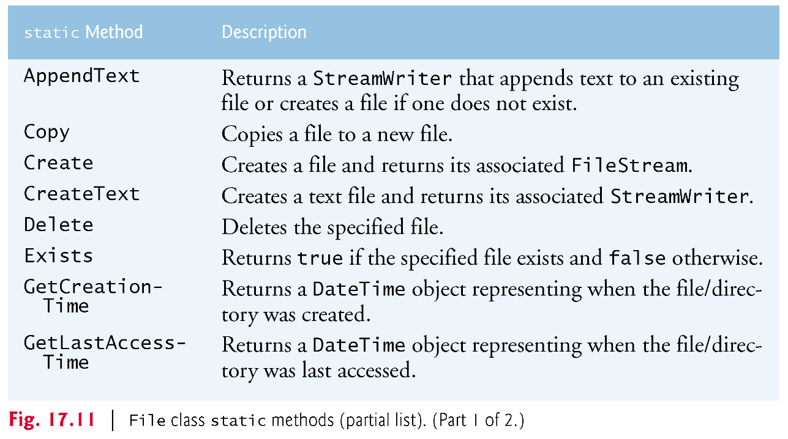
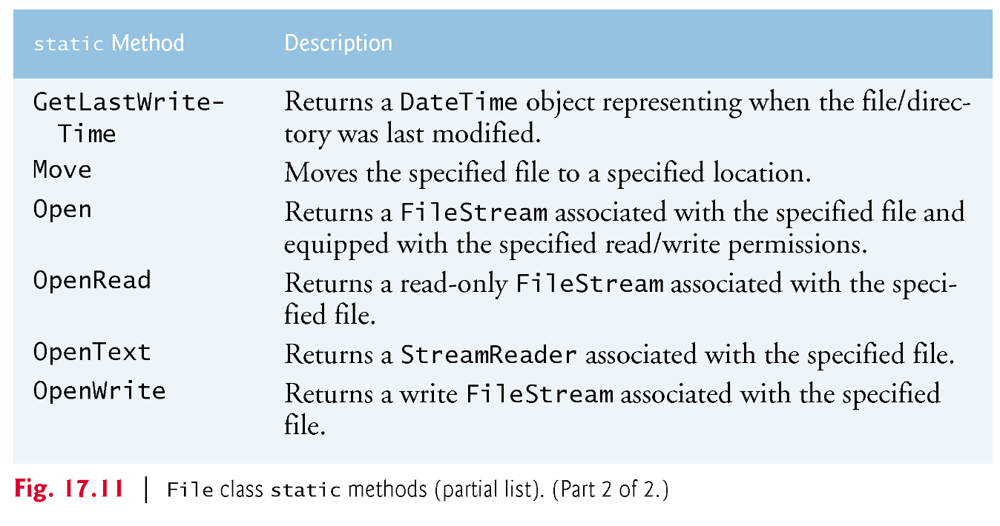
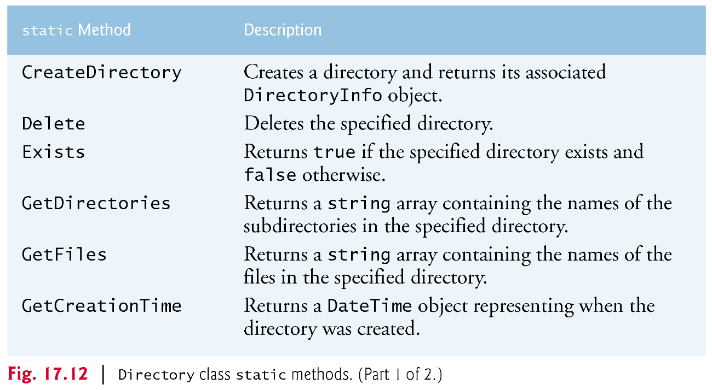
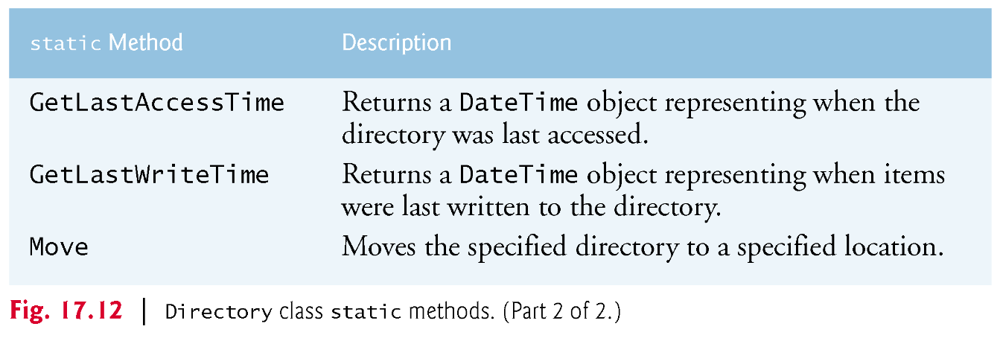
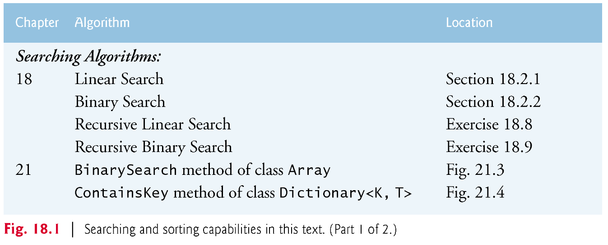
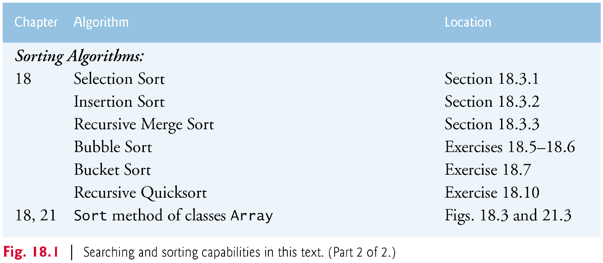
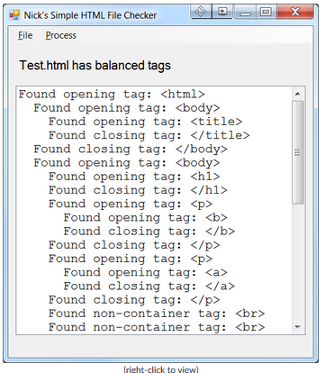
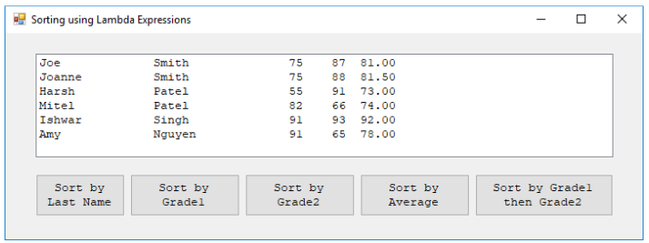

# Programming in .NET
#### by Prof. Trishan Gunness 
---
# Announcements  

- Assignment Lab 3 due March 24th 2024 11:59pm

---

# Recap:
- Week 1 - Introduced .NET & Visual Studio
- Week 2 - Introduced C# Language
- Week 3 - Introduced Lists and LINQ
- Week 4 - OOP Fundamentals - Classes and Objects
- Week 5 - OOP Fundamentals - Relationships
- Week 6 - GUI - Forms and Events
- Week 7 - Midterm
- Week 8 Part 1 - Strings, Characters, Files & Streams, Serialization
- Week 8 Part 2 - Gaming I
- **Week 9 Part 1 - Serialization, Classes File and Directory, Searching and Sorting**
---

# Today

## Topics
- Serialization (continue)
- Classes File and Directory
- Sorting with Lambda

### Lab 4 Introduction

---
# Serialization (cont.)
- Problem: For instance, if the value "3" is read from a file, there’s no way to tell if the value came from an int, a string or a decimal. 
- Serialization can fix this problem as you are able to encode both data and information.
- Serialization is used in C# in various real-world scenarios to convert object data into a format that can be easily stored, transmitted, or reconstructed.
- Serialization in C# plays a crucial role in many industries as it allows data to be transformed into many portable formats that can be used across different systems and platforms.

- Example: When data needs to be sent over a network, it is often serialized into a format like JSON or XML before transmission. The receiving end deserializes the data to reconstruct the original object.

---

# Serialization 

DEMO - WriteSerializedStudentDataFile

---
# Serialization 

DEMO - ReadSequentialAccessFile

---

# Classes File and Directory
- Information is stored in files, which are organized in directories (also called folders).
- Classes `File` and `Directory` enable programs to manipulate files and directories on disk.
- Class `File` can determine information about files and can be used to open files for reading or writing.
- Figure 17.11 lists several of class `File` static methods for manipulating and determining information about files.

---

---

---

# Classes File and Directory

- Class `Directory` provides capabilities for manipulating directories.
- Figure 17.12 lists some of class `Directory`’s static methods for directory manipulation.
- The DirectoryInfo object returned by method `CreateDirectory` contains information about a directory.
- Much of the information contained in class `DirectoryInfo` also can be accessed via the methods of class `Directory`

---

---

---
# Classes File and Directory 

DEMO - FileTestForm

---
# Searching and Sorting

- **Searching** data involves determining whether a value (referred to as the search key) is present in the data and, if so, finding the value’s location.
  - Two popular search algorithms are the simple linear search and the faster, but more complex, binary search.
- **Sorting** places data in order, based on one or more sort keys.
- Figure 18.1 summarizes the searching and sorting algorithms discussed in book
---

---

---

# Sorting with Lambda
Sorting in C# with lambda expressions provides a concise and readable way to customize the sorting of collections or lists of objects.

- Lambda expressions in C# are inline, anonymous functions.
- Lambda expressions are commonly used for sorting in LINQ and other scenarios.
- With lambda expressions, you can define sorting criteria and logic directly within the sorting method.
- This eliminates the need for creating separate comparison logic, making your code more compact and maintainable.
- Lambda expressions allow for in-line customization of sorting criteria, making it easier to sort objects by specific properties.
- Sorting with lambda expressions is particularly useful when dealing with complex sorting requirements or when you want a more readable and concise approach to sorting data.

---
# Sorting with Lambda

DEMO - SortingWithLambda

---
# Lab 4 - Introduction

[Lab 4 Assignment](https://mycanvas.mohawkcollege.ca/courses/92925/pages/lab-assignment-4)

---

# Lab 4 - Part A: It Takes All Sorts

In Lab 1 you read a file of Employee objects into an array.  That array could be sorted on any of the fields of the class.  Since then, we've learned about properties, generics, collections, and lambda expressions.

Using your solution (or mine) rewrite Lab 1 so that it:
- Eliminates the need for Get()/Set() methods in the Employee class by using properties instead
- Eliminates the array (and the arbitrary limit) that stores all of the Employee objects, and instead utilizes a generic List<T> collection
- Eliminates the Sort() method that you researched and instead relies on the built-in Sort() method of the List<T> collection
- Makes use of the IComparable interface so that each field of the Employee class can be sorted
- Alternatively, you can use a lambda expression for sorting instead of the IComparable technique
- Looks and behaves identically to the solution for Lab 1 but utilizes the above changes
- Contains a highly modularized Main() method

---

# Lab 4 - Part B: A Tangled Web
Write a Windows Form App (.NET Framework) that:
- Makes use of a GUI interface that has menu options
- The File=>Load menu option displays an OpenFileDialog to allow the user to select a valid HTML file
- Makes use of the OpenFileDialog.Filter property to allow only HTML files to be selected
- Uses a generic Stack<T> collection to read the HTML file and determine if the HTML container tags are properly balanced
- (that is, each opening tag has a corresponding closing tag)
- Displays a status indicating whether the container tags are balanced, or not balanced
- Ignores certain HTML tags that are not container tags (such as ``, `
` or ` `)
- Contains a modularized Process=>Check Tags method
- You may download this sample program 

Download sample program for a demonstration of program behaviour
Here are examples of good and bad test files that you can use to test your program: TestFiles.zip

---
# Lab 4 - Part B: A Tangled Web

---

# Today's Exercise 
Sorting using Lambda expressions in C#.Net

[Link to Exercise](https://mycanvas.mohawkcollege.ca/courses/92925/files/16713010?module_item_id=4763059)

---

# Conclusion
- Serialization (continue)
- Classes File and Directory
- Sorting with Lambda

---
# Next Class
## Gaming II

---

# END